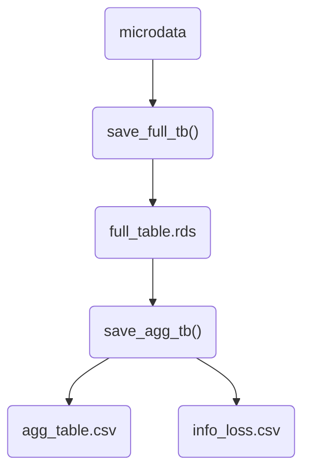

# iLBA: An R Program for Confidentially Disseminating Aggregated Frequency Tables

Umich STATS 607 Unit 1 Project, Fall 2025

This project implements the _Information Loss Bounded Aggregation (iLBA)_ algorithm from _Disseminating massive frequency tables by masking aggregated cell frequencies_ (Park et al., 2024) in R, using synthetic data that resembles census data.

---
## How to Run

After cloning the repository, there are two ways to run this project:

### 1. From the Terminal
Move into the project root directory, and run:

```bash
Rscript run_analysis.R
```

### 2. From RStudio

1. Open the project file `Project1.Rproj` in RStudio.  
2. In the **Files** pane, double-click `run_analysis.R` to open it.  
3. Run the script.

---
## About the _iLBA_ Algorithm

The _iLBA_ algorithm is a method for confidentially aggregating frequency tables, currently implemented by _Statistics Korea_. It is designed to prevent individual disclosure by ensuring at least _K-anonymity_ (i.e., no individual can be identified with probability greater than 1/K) when full table is aggregated for specific combinations of hierarchical key variables (e.g., region) and other key variables (e.g., sex, income) in census data. The iLBA algorithm simultaneously controls disclosure risk and limits information loss within a bounded range.

The *iLBA* implementation provides two main functions:

1. **`save_full_tb(data, hkey, key = NULL, mask_threshold = 3, rank = NULL, key_unique_threshold = 100, output_path = "full_table.rds")`**  
   - Generates a full frequency table from microdata using hierarchical key variables (`hkey`) and other key variables (`key`).  
   - Small cells below the `mask_threshold` are masked using the *Small Cell Adjustment (SCA)* method.  
   - The resulting full frequency table is saved in `.rds` format in `output_path`.  

2. **`save_agg_tb(hkey_level, key, input_path = "full_table.rds", output_table_path = "agg_table.csv", output_infoloss_path = "infoloss.csv")`**  
   - Produces aggregated frequency tables based on the full table generated by `save_full_tb`.  
   - Aggregation is performed confidentially using the *iLBA* algorithm.  
   - The aggregated frequency tables are saved in `.csv` format in `output_table_path`.
   - An additional `.csv` file is created to record the information loss resulting from the iLBA process in `output_infoloss_path`.



---
## Example Workflow

Suppose we have the following **microdata** with two hierarchical keys (`hkey1`, `hkey2`) and one categorical variable (`key`):

### Microdata
| ID  | hkey1 | hkey2 | key |
| --- | ----- | ----- | --- |
| 1   | 11    | 11010 | 1   |
| 2   | 11    | 11010 | 1   |
| 3   | 11    | 11010 | 1   |
| 4   | 11    | 11010 | 2   |
| 5   | 11    | 11010 | 2   |
| 6   | 11    | 11011 | 1   |
| 7   | 11    | 11011 | 2   |

### Step 1. `save_full_tb()`: Full Frequency Table with SCA Masking

The function builds a full frequency table at the most detailed level. Small cell counts (below `mask_threshold = 3`) are masked using *Small Cell Adjustment (SCA)*.

For second row with `count`$=2$, `masked_count` is 3 with probability $\frac{2}{3}$ and 0 with probability $\frac{1}{3}$. 
For third and fourth rows with `count`$=1$ `masked_count` is 3 with probability $\frac{1}{3}$ and 0 with probability $\frac{2}{3}$. 

| hkey1 | hkey2 | key | count | masked_count |
| ----- | ----- | --- | ----- | ------------ |
| 11    | 11010 | 1   | 3     | 3            |
| 11    | 11010 | 2   | 2     | 3 (0 or 3)   |
| 11    | 11011 | 1   | 1     | 3 (0 or 3)   |
| 11    | 11011 | 2   | 1     | 0 (0 or 3)   |

### Step 2. `save_agg_tb()`: Aggregated Table with iLBA

Next, we aggregate the table to the higher `hkey1` level. The *iLBA* algorithm adjusts the sums so that aggregated small cells remain confidential, while bounding the information loss.

| hkey1 | key | count | masked_count | infoloss |
| ----- | --- | ----- | ------------ | -------- |
| 11    | 1   | 4     | 5            | -1       |
| 11    | 2   | 3     | 2            | 1        |
